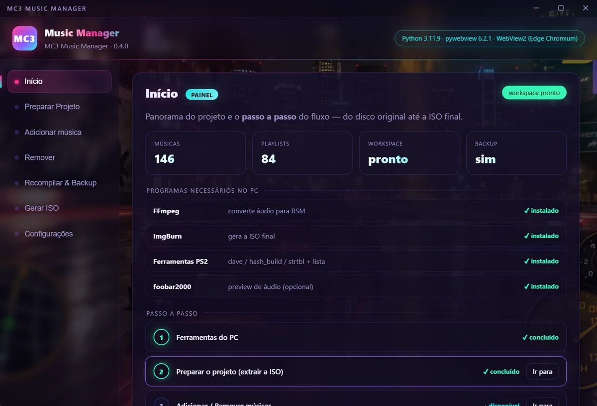
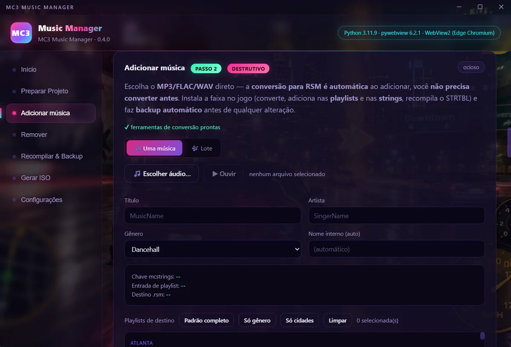
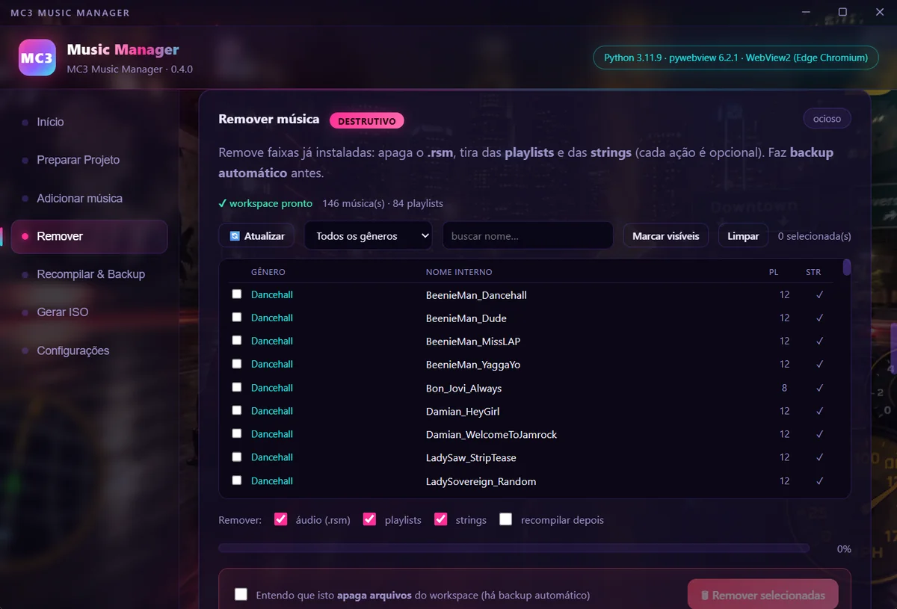
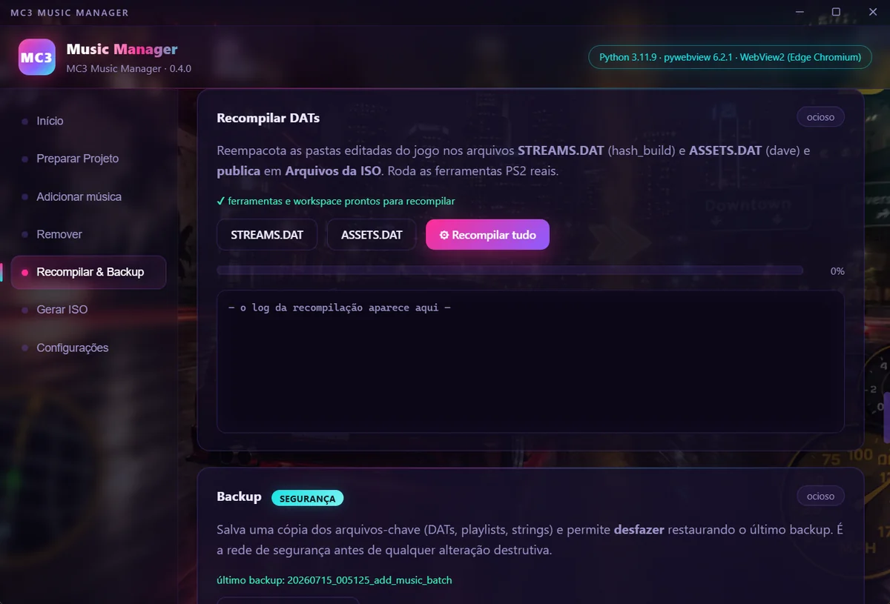
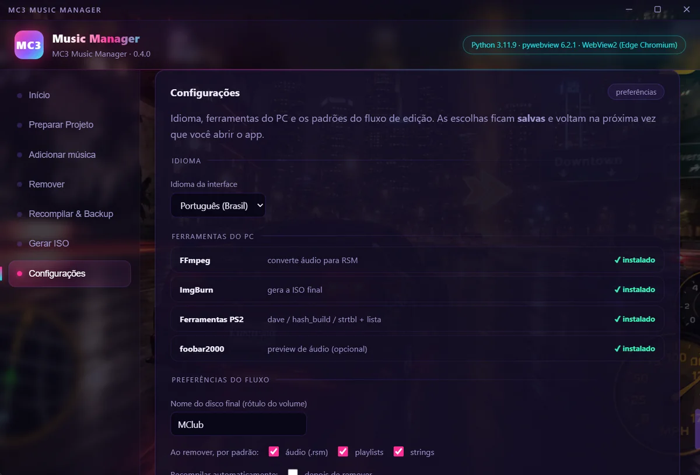

# MC3 Music Manager

Troque a trilha sonora do **Midnight Club 3: DUB Edition Remix** (PlayStation 2) pelas
suas próprias músicas — a partir da **sua** cópia do jogo, na **sua** máquina, sem
enviar nada para lugar nenhum.

App de desktop para Windows: interface em HTML/CSS/JS numa janela nativa
(**pywebview** sobre o Edge WebView2), backend em **Python**.



> ### ⚠️ Nenhum arquivo do jogo acompanha este programa
>
> *Midnight Club 3: DUB Edition Remix* é © Rockstar Games / Take-Two Interactive.
> Este é um projeto **não-oficial**, sem vínculo com a Rockstar ou a Take-Two.
> Todo o conteúdo do jogo (ASSETS, STREAMS, playlists, textos, ISO) é gerado a partir
> do disco que **você** já tem. Você é responsável por respeitar as leis de direito
> autoral do seu país, tanto quanto à cópia de segurança do jogo quanto às músicas
> que adicionar.

---

## O que ele faz

O app guia o ciclo inteiro, do disco original à ISO modificada:

| # | Passo | O que acontece |
|---|---|---|
| 1 | **Preparar Projeto** | Confere se a ISO é a versão suportada, copia o conteúdo para uma pasta de trabalho e descompila `ASSETS.DAT`, `STREAMS.DAT` e a tabela de textos |
| 2 | **Adicionar música** | MP3/FLAC/OGG/M4A/WAV → formato do PS2, com título, artista, gênero e playlists. Uma faixa por vez ou **em lote** |
| 3 | **Remover** | Lista o que está instalado e tira o áudio, as entradas de playlist e os textos |
| 4 | **Recompilar & Backup** | Remonta os `.DAT` e mantém sessões de backup restauráveis |
| 5 | **Gerar ISO** | Constrói a ISO final via ImgBurn, pronta para emulador ou PS2 |

Outras coisas que ele faz por você:

- **Backup automático** antes de toda operação destrutiva, com restauração por sessão.
- **Confere o espaço em disco** antes de copiar e antes de descompilar (o processo
  todo pede uns 20 GB) — em vez de morrer no meio.
- **Recusa uma ISO que não seja a versão suportada**, em vez de produzir um jogo quebrado.
- **Lê as tags** do arquivo de áudio e preenche título/artista sozinho.
- Instala **ffmpeg**, **ImgBurn** e **foobar2000** via `winget`, se você não os tiver.
- **Relatório de erro em um clique**: junta o diagnóstico do app com o último erro e
  abre a página de issues já preenchida — você revisa e publica. Nada é enviado sem você.

### As telas

**Adicionar música** — escolha o MP3/FLAC/WAV e pronto: a conversão para RSM acontece
sozinha. Título, artista e gênero vêm das tags; as playlists de destino são marcáveis
uma a uma ou por atalho (padrão completo, só gênero, só cidades).



**Remover** — lista tudo que está instalado, com busca e filtro por gênero, quantas
playlists citam cada faixa e se ela tem texto na tabela do jogo. Toda ação destrutiva
exige marcar a confirmação antes de o botão funcionar.



**Recompilar & Backup** — remonta os `.DAT` com as ferramentas PS2 reais e mantém a
rede de segurança: cada operação destrutiva salva uma sessão de backup restaurável.



### Sobre o formato do áudio

Uma faixa convertida "quase certo" toca **muda** no jogo. O `.rsm` que as ferramentas
públicas geram diverge do formato do MC3 em quatro campos (taxa de amostragem, início
do loop, o campo em `0x24` e um frame de inicialização do SPU). Isso foi medido contra
as 135 músicas do próprio jogo e é corrigido automaticamente em toda conversão.
**Confirmado no jogo**: 12 faixas adicionadas pelo app tocaram normalmente.

## Idiomas

Interface e mensagens em **7 idiomas** — português, inglês, espanhol, francês, alemão,
italiano e japonês (os 6 do próprio jogo, mais o português). Na primeira execução o app
segue o idioma do Windows; depois é trocável a qualquer momento, ao vivo.



> As traduções ainda não passaram por revisão de falantes nativos. Correções são
> bem-vindas — cada idioma é um único arquivo em `frontend/locales/`.

## Requisitos

- **Windows 10 ou 11** (o WebView2 já vem instalado).
- Sua própria cópia de *Midnight Club 3: DUB Edition Remix* (PS2), em ISO.
- **ffmpeg** e **ffprobe** — veja [Ferramentas externas](#ferramentas-externas).
- **ImgBurn**, só para gerar a ISO final. O app oferece instalar.
- Uns **20 GB livres** durante o processo.

## Instalar

Baixe o `MC3_Music_Manager_Setup.exe` da página de **Releases** — ou gere o seu, veja
[Empacotar](#empacotar). A instalação é **por usuário, sem pedir administrador**.

> O instalador não é assinado digitalmente, então o SmartScreen do Windows vai avisar
> que o autor é desconhecido: *Mais informações* → *Executar assim mesmo*.

## Rodar do código-fonte

```bash
pip install -r requirements.txt
python main.py
```

Testado com **Python 3.14** e **pywebview 6.2**. Para abrir o DevTools numa build
empacotada, defina `MC3_DEBUG=1`.

## Ferramentas externas

O repositório **não** guarda `ffmpeg.exe` nem `ffprobe.exe` (189 MB somados): são
redistribuíveis de terceiros e a build exata está creditada em [LICENSES.md](LICENSES.md).
Numa cópia nova do código, baixe uma build Windows em
<https://www.gyan.dev/ffmpeg/builds/> e copie os dois para `tools/wav to rsm/`.

Sem o `ffmpeg` o app **não converte** MP3/FLAC/OGG (só `.wav`/`.ads`/`.ss2`/`.rsm` passam
direto); sem o `ffprobe` ele **não lê as tags**, e o preenchimento de título/artista cai
para adivinhação pelo nome do arquivo.

As ferramentas PS2 da comunidade (`dave.py`, `hash_build.py`, `strtbl.py`,
`rstm_build.exe`) **estão** versionadas: são pequenas e difíceis de reobter. Junto com
elas vão `ps2str.exe` e `encvag.dll`, que **não** são da comunidade — são componentes do
SDK do PlayStation 2, com copyright da Sony Computer Entertainment. O `rstm_build`
depende dos dois para converter WAV. Leia o aviso completo em [LICENSES.md](LICENSES.md).

Confira o que o pacote vai levar:

```bash
python packaging/make_tools_bundle.py --check
```

## Empacotar

```bash
python packaging/make_tools_bundle.py
python -m PyInstaller packaging/mc3.spec --noconfirm --distpath build_out/dist --workpath build_out/work
ISCC.exe packaging\mc3.iss
```

O `mc3.spec` **falha o build de propósito** se faltar um item obrigatório no bundle, ou
se encontrar dados de usuário (backups, `STREAMS/`, `ASSETS/`, `.DAT`) na pasta de saída
— foi assim que o `ffprobe.exe` ficou de fora uma vez e a leitura de tags morreu em
silêncio no app instalado.

## Testes

```bash
python -m pytest -q
```

**123 testes** e cerca de **5.400 subtestes** (integridade dos 7 catálogos de tradução).
Cobrem a conversão de áudio, a recompilação, a validação de entrada, o backup, os
pré-voos de disco e ISO, e a conformidade do `.rsm` com o formato do jogo.

## Estrutura

```
main.py                  # entrada: cria a janela pywebview e expõe a Api
backend/
  core.py                # lógica de domínio — zero import de UI
  api.py                 # ponte JS -> Python (pywebview.api.*)
  bridge.py              # ponte Python -> JS (progresso/log/status ao vivo)
  tasks.py               # tarefas em segundo plano
frontend/
  index.html             # a interface
  css/style.css          # tema
  js/app.js              # controlador + motor de i18n
  locales/*.json         # 7 idiomas, uma chave por mensagem
tools/                   # CLIs PS2 (dave, hash_build, strtbl, rstm_build)
packaging/               # spec do PyInstaller, script do Inno Setup, ícone
tests/                   # a suíte
```

`backend/core.py` não importa nada de UI: recebe callbacks de progresso e levanta
exceções. É o que permite testar o fluxo inteiro sem abrir uma janela.

## Licenças e aviso legal

- O **código deste repositório** está sob a licença MIT — veja [LICENSE](LICENSE).
- Os **componentes de terceiros** que acompanham o programa (ffmpeg, ferramentas PS2,
  pywebview, WebView2) têm avisos próprios em [LICENSES.md](LICENSES.md). Leia antes de
  redistribuir.
- **Sem garantia.** O programa mexe nos arquivos do seu jogo. Ele faz backup automático
  antes de qualquer operação destrutiva, mas o uso é por sua conta e risco. Mantenha
  sempre uma cópia da sua ISO original.

## Histórico e planejamento

[ROADMAP.md](ROADMAP.md) tem o plano faseado e o que já foi entregue.
[CLAUDE.md](CLAUDE.md) é o caderno técnico: decisões tomadas, armadilhas encontradas e
o porquê de cada uma.
